# 🏝️ The Forgotten Island

**Genre:** Survival & Adventure  


---

## 📖 Description

After a shipwreck, the protagonist finds himself stranded on a mysterious island. Soon he realizes the island is not deserted and must navigate dangers to escape.  

The player must progress through **3 levels** (forest, volcano, swamp), avoid enemies, collect resources, and finally reach the boat to escape.  

---

## 🎮 Gameplay

- **Main Objective:** collect the key to advance to the next level and ultimately escape the island. 

| Key | Action |
|-----|--------|
| ⬆️   | Move Up |
| ⬇️   | Move Down |
| ⬅️   | Move Left |
| ➡️   | Move Right |
| Esc | Pause |
| T   | Debug (Developer Mode) |


💯 **Score Formula:**  
```
Score = Coins × 100 + Keys × 400 − Time_in_seconds
```
---
### Enemies
- **Orc** – moves randomly, speed = 8.  
<!-- 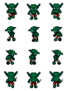 -->

- **Blaze** – follows a predetermined path, speed = 8.  
<!-- 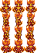 -->

- **Chupacabra** – follows a path but may chase the player with a 50% probability when within 5 tiles; stops chasing at ≥13 tiles distance.  
<!-- 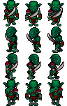 -->


### Levels

1. **Forest 🌲**  
   - Obstacles: trees & rocks  
   - Enemies: Orcs  
   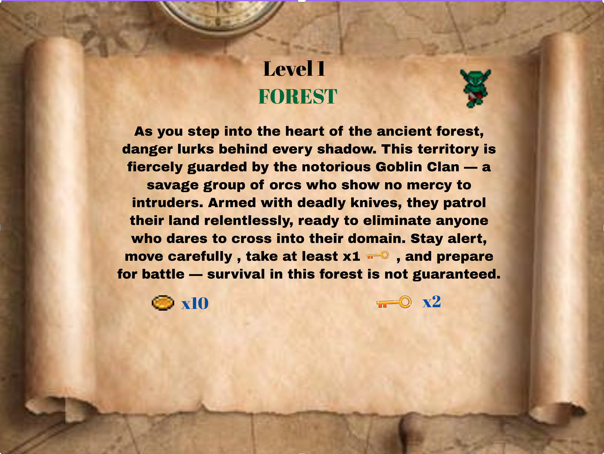  
   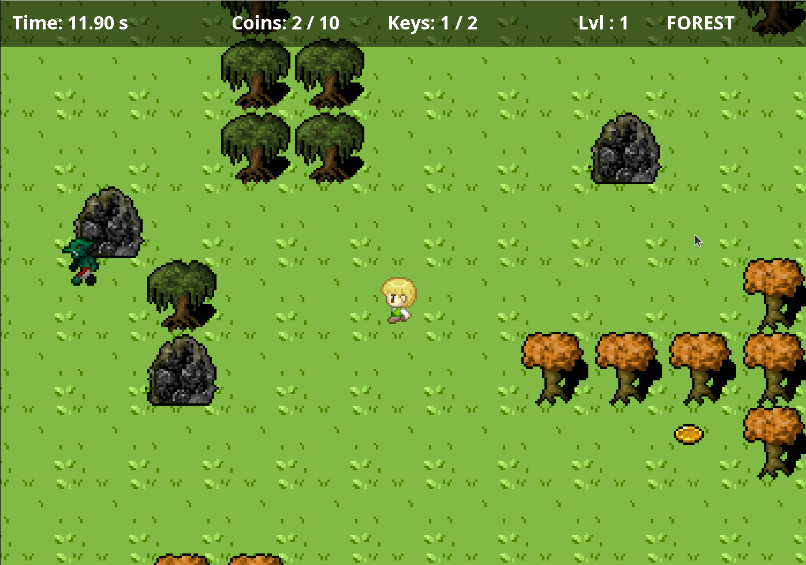  

2. **Volcano 🌋**  
   - Obstacles: lava rivers  
   - Enemies: Blaze + Orcs  
   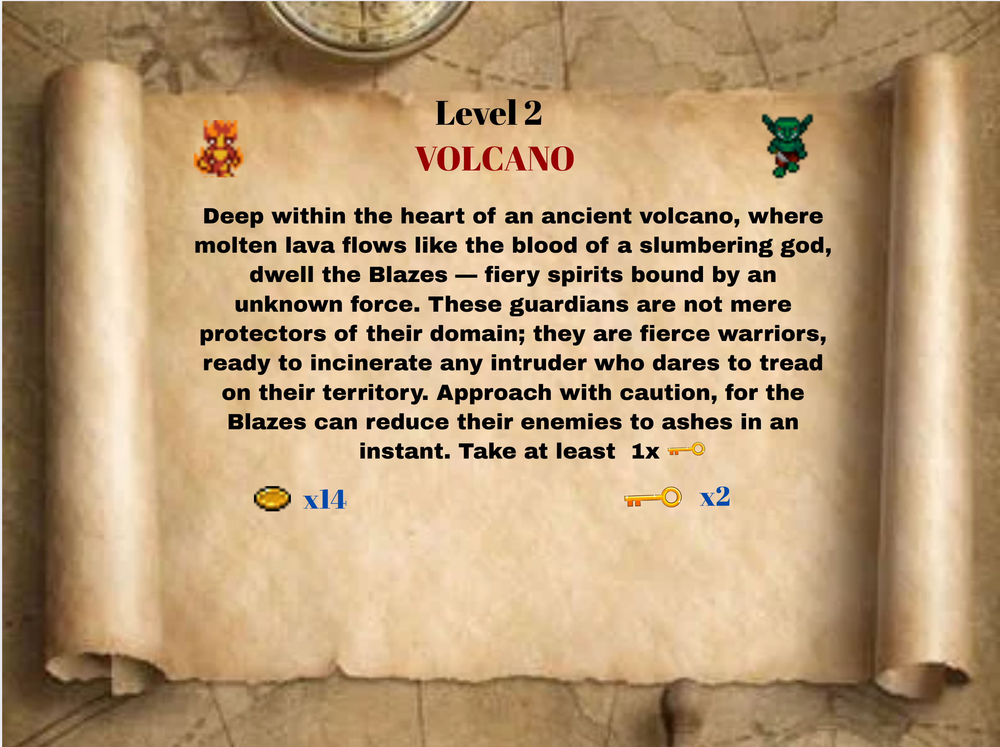  
   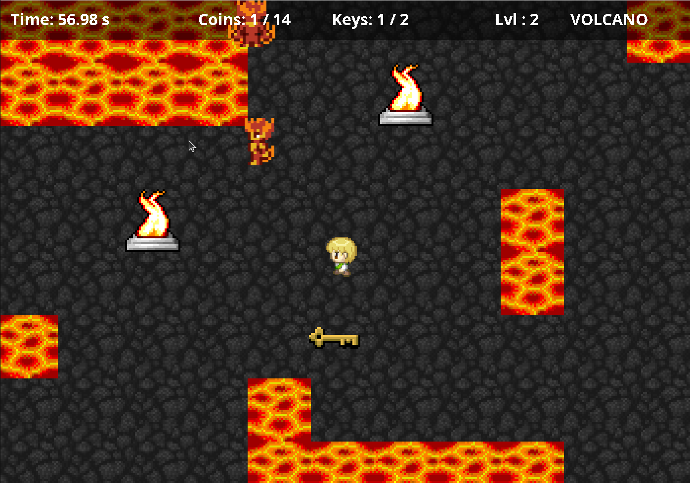  

3. **Swamp 🐉**  
   - Obstacles: swamp waters  
   - Enemies: Chupacabra + swamp Orcs  
   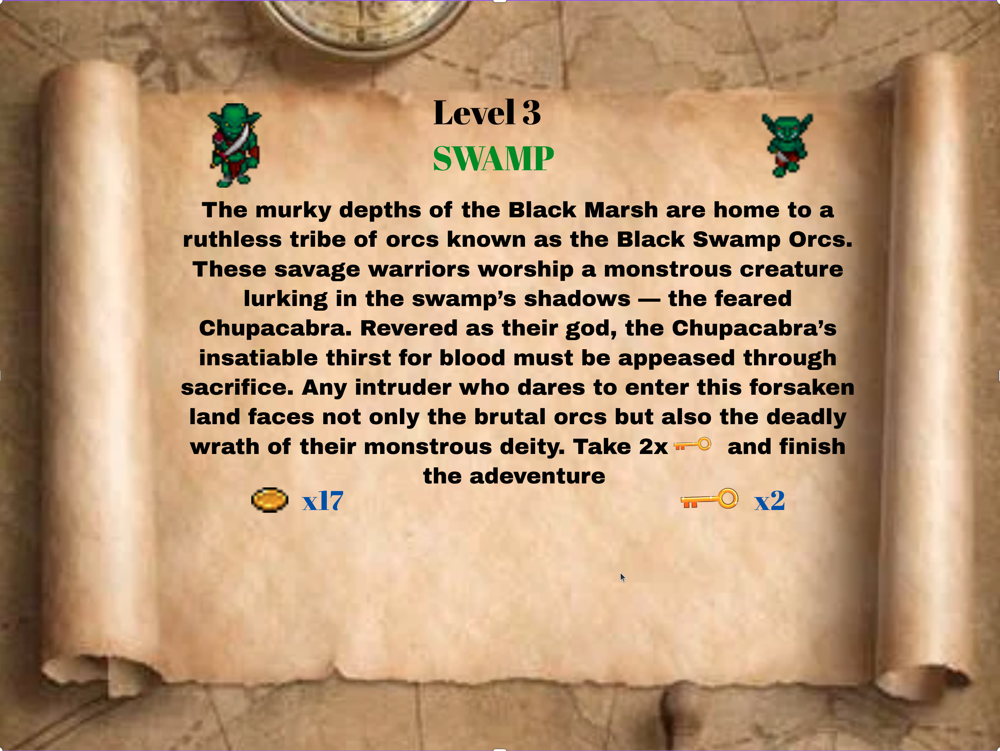  
   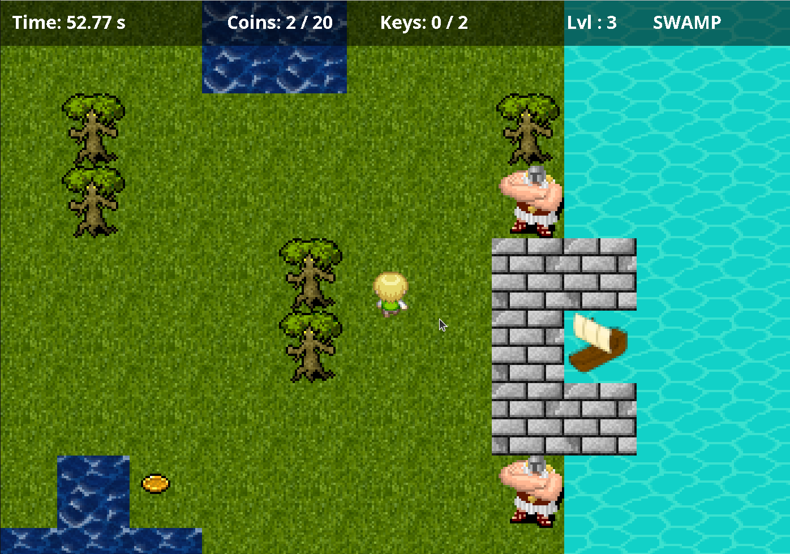


### MAIN MENU
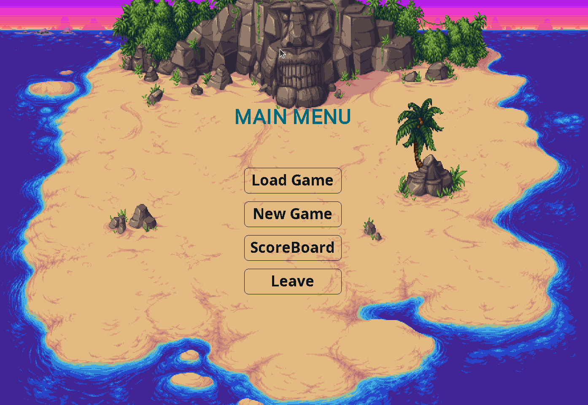

### SCOREBOARD


<!-- ### LOG IN/SIGN UP
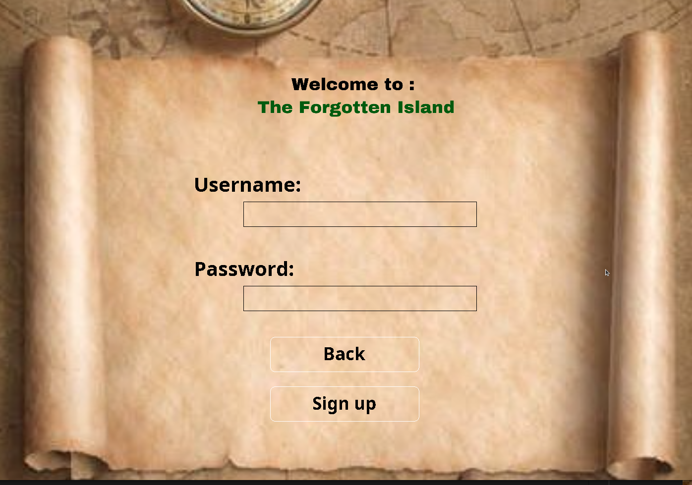 -->

## 🛠️ Architecture & Design Patterns

- **Singleton:** Game, GameWindow, DatabaseManager, Music, Timer, SoundPlayer  
- **Factory Method:** creation of enemies and hero  
- **Strategy & State:** dynamic entity behavior  
- **Threading:** database connection runs on a separate thread (via `SwingWorker`) to avoid UI blocking  

---

## 💾 Database

The project uses **two databases**:
- **Oracle Autonomous Database (cloud)** – for online save/load  
- **SQLite (local)** – as fallback when internet is unavailable  

### Main Tables

| Table     | Fields                                  | Description |
|-----------|----------------------------------------|-------------|
| Players   | ID, Username, Password, Score           | Stores player info and scores |
| Levels    | player_position, level, progress, timer, score | Tracks level progress |
| Coins & Maps | map_layouts, coin_positions, collision_maps | Stores game maps and coin placement |


---

## 🔑 Additional Features
- **Authentication:** Sign-up / Log-in with exception handling  


- **Save & Load progress:** user can choose between cloud or local database  

- ***Pause menu:*** accessible via `Esc` key  


## Collaborators
- Loghin Elisei 
- Hutanu Laurentiu

## ⚠️ Warning 
- For better user experience use Linux to play this game
